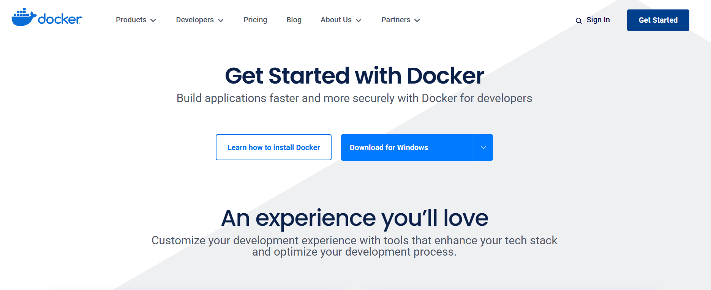
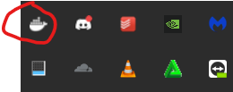
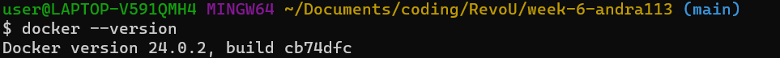
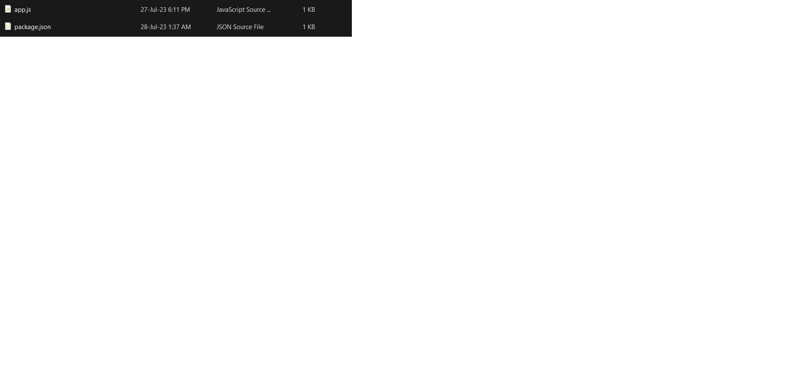
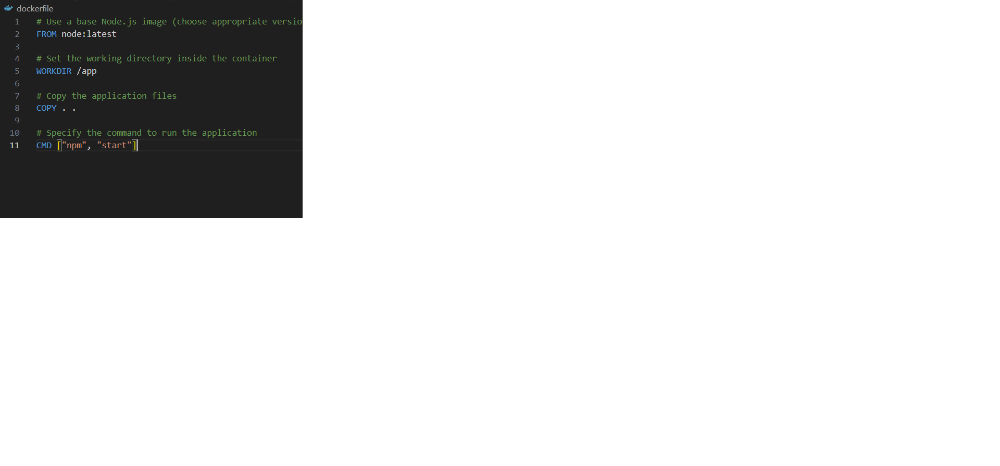
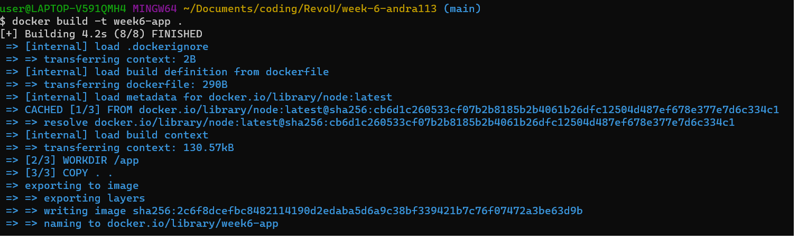
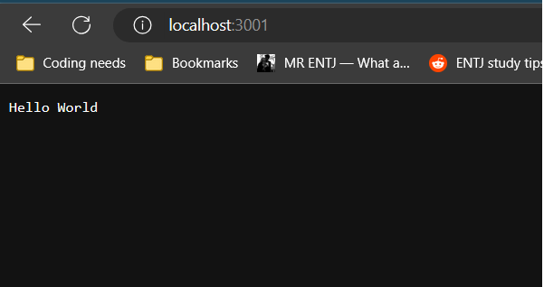

Hey there! 👋🏻 I'm Andra, and I created this documentation about how to run NodeJS app through Docker Container

This documentation will guide you through the process installing Docker and building NodeJS image and run the Docker container using command prompt or terminal.

## Table of Contents

- [Table of Contents](#table-of-contents)
- [Prerequisites](#prerequisites)
- [Installing Docker on Windows](#installing-docker-on-windows)
  - [1. Download Docker Desktop](#1-download-docker-desktop)
  - [2. Run the Installer](#2-run-the-installer)
  - [3. Docker Setup Complete](#3-docker-setup-complete)
  - [4. Docker Running](#4-docker-running)
  - [5. Verify Docker Installation](#5-verify-docker-installation)
- [How to build nodejs application into a Docker Container](#how-to-build-nodejs-application-into-a-docker-container)
  - [1. Put node app and package.json in same directory](#1-put-node-app-and-packagejson-in-same-directory)
  - [2. Create a Dockerfile](#2-create-a-dockerfile)
  - [3. Build docker images using command prompt or terminal.](#3-build-docker-images-using-command-prompt-or-terminal)
  - [4. Run the docker container.](#4-run-the-docker-container)

## Prerequisites
- 
- Node app from  [](https://github.com/dashboard)

## Installing Docker on Windows

### 1. Download Docker Desktop

Visit the Docker website at [https://www.docker.com/get-started](https://www.docker.com/get-started) and download the Docker Desktop installer for Windows.



### 2. Run the Installer

- Once the Docker Desktop installer is downloaded, double-click on it to run the installation process.
- Check the option if you want to create Docker Shorcut on desktop
- Docker is installing, it may takes a few minute
  

### 3. Docker Setup Complete

Once the installation is finished, Docker Desktop will be launched, and a Docker icon will appear in the system tray.

### 4. Docker Running

Look for the Docker icon in the system tray. Right-click on the icon to access the Docker menu.



### 5. Verify Docker Installation

Open a terminal or PowerShell window and run the following command to verify that Docker is installed correctly:

```bash
docker --version
```



## How to build nodejs application into a Docker Container

### 1. Put node app and package.json in same directory



### 2. Create a Dockerfile

Create a dockerfile(withou extension) in same directory with node app and package.json. The Dockerfile will contain instructions to build the Docker image for your application.


<br>
Copy following code into the Dockerfile

```bash

# Use a base Node.js image (choose appropriate version)

FROM node:latest

# Set the working directory inside the container

WORKDIR /app

# Copy the application files

COPY . .

# Specify the command to run the application

CMD ["npm", "start"]

```



### 3. Build docker images using command prompt or terminal.
Navigate to directory to containing dockerfile and run following command to build the Docker image

```bash
docker build -t nodejs-app-name .
```



### 4. Run the docker container.
   After the image is built, you can run a container from the created image using the following command:
   ```bash
   docker run -p 3001:3001 nodejs-app-name
   ```
   This will map port 3001 from the container to port 3001 on your host machine, allowing you to access the running Node.js application in the container via localhost:3001.
   <br>
   Example when running on my local machine
   
   Checking if nodejs app is working by accessing localhost:3001
   
