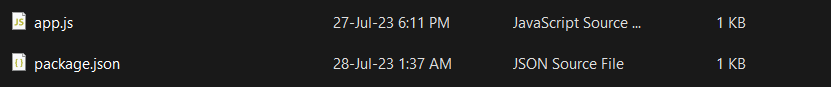

## How to build nodejs application into a Docker Container

1. Put node app and package.json in same directory

   

2. Create a dockerfile (withou extension) in same directory with node app and package.json. The Dockerfile will contain instructions to build the Docker image for your application.

   
   <br>
   Copy following code into the Dockerfile

   ```
   # Use a base Node.js image (choose appropriate version)
   FROM node:latest

   # Set the working directory inside the container
   WORKDIR /app

   # Copy the application files
   COPY . .

   # Specify the command to run the application
   CMD ["npm", "start"]
   ```

   

3. Build docker images using command prompt or terminal.
   Navigate to directory to containing dockerfile and run following command to build the Docker image

   ```bash
   docker build -t nodejs-app-name .
   ```

   example image when running on my local machine
   

4. Run the docker container.
   After the image is built, you can run a container from the created image using the following command:
   ```bash
   docker run -p 3001:3001 nodejs-app-name
   ```
   This will map port 3001 from the container to port 3001 on your host machine, allowing you to access the running Node.js application in the container via localhost:3001.
   <br>
   Example when running on my local machine
   
   See if nodejs app is working by accessing localhost:3001
   
