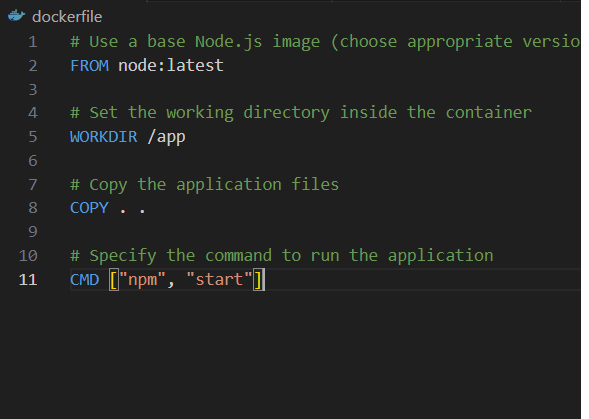

## Installing Docker on Windows

### Step 1: Download Docker Desktop

Visit the Docker website at [https://www.docker.com/get-started](https://www.docker.com/get-started) and download the Docker Desktop installer for Windows.


### Step 2: Run the Installer

- Once the Docker Desktop installer is downloaded, double-click on it to run the installation process.
- Check the option if you want to create Docker Shorcut on desktop
- Docker is installing, it may takes a few minute
  

### Step 3: Docker Setup Complete

Once the installation is finished, Docker Desktop will be launched, and a Docker icon will appear in the system tray.

### Step 9: Docker Running

Look for the Docker icon in the system tray. Right-click on the icon to access the Docker menu.


### Step 10: Verify Docker Installation

Open a terminal or PowerShell window and run the following command to verify that Docker is installed correctly:

```bash
docker --version
```


## How to build nodejs application into a Docker Container

### 1. Put node app and package.json in same directory


### 2. Create a Dockerfile

Create a dockerfile(withou extension) in same directory with node app and package.json. The Dockerfile will contain instructions to build the Docker image for your application.


<br>
Copy following code into the Dockerfile

```bash

# Use a base Node.js image (choose appropriate version)

FROM node:latest

# Set the working directory inside the container

WORKDIR /app

# Copy the application files

COPY . .

# Specify the command to run the application

CMD ["npm", "start"]

```



### 3. Build docker images using command prompt or terminal.
Navigate to directory to containing dockerfile and run following command to build the Docker image

```bash
docker build -t nodejs-app-name .
```

example image when running on my local machine


### 4. Run the docker container.
   After the image is built, you can run a container from the created image using the following command:
   ```bash
   docker run -p 3001:3001 nodejs-app-name
   ```
   This will map port 3001 from the container to port 3001 on your host machine, allowing you to access the running Node.js application in the container via localhost:3001.
   <br>
   Example when running on my local machine
   
   Checking if nodejs app is working by accessing localhost:3001
   
